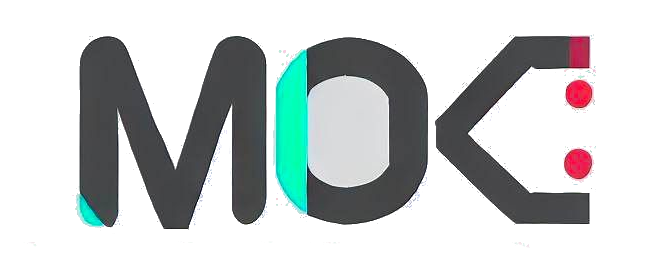

English | [简体中文：墨客实验室](README_ZH.md)

# XmacsLabs

XmacsLabs is a non-profit organization on earth. We collaberate to create tools for everyone to **enjoy exploring science and technology**!

| Project | What | Status |
|---------|------|--------|
| [Mogan Editor](https://mogan.app) | a structured editor based on GNU TeXmacs | Stable |
| Mogan Language | a structured programming language | Designing  |
| Xmacs Planet | public docs by the Xmacs community | Beta |
| TMML Wiki | wiki of Science and Technology | Alpha |

## Open Structured Text

| Name | Language | Status | License |
|------|------|------|------|
| [《Mozi》](https://gitee.com/XmacsLabs/mozi) | Simplified Chinese  | WIP | |
| [《Interactive SICP》](https://gitee.com/XmacsLabs/interactive-sicp) | English | First two chapters available |  |

## Who are we?
| Name | Intro | Social Media |
|------|------|----------|
| BadVortex恶漩 | Graduated Student of China Academy of Art who are teaching Baby Rudin on Bilibili | [Bilibili](https://space.bilibili.com/32125090) |
| 张志雄 | High school math teacher | [Gitee](https://gitee.com/zzx87) |
| Yiqi Xu | Advanced Mogan user | [Github](https://github.com/YiqiXu)/[Gitee](https://gitee.com/xuyiqi1)
| jadelight | Professor who are using Mogan Editor for live teaching | [Gitee](https://gitee.com/jadelight) |
| Proctor | Lawyer, advanced Mogan user and the counsellor at Law for the Xmacs Labs | |
| 徐杰 | Esperantist, polyglot, translator and counsellor at Language for the Xmacs Labs | [Github](https://github.com/xujie8410) |
| Darcy Shen | Creator of the Xmacs Labs, one of the authors of [Liga](https://github.com/komprenilo/liga), Data Engineer and Scala enthusiast | [Bilibili](https://space.bilibili.com/28058658)/[Github](https://github.com/darcy-shen)/[Gitee](https://gitee.com/darcyshen) |
| PikachuHy | Mogan Developer and Compiler Engineer | [Github](github.com/PikachuHy) |
| jingkaimori | Mogan Developer | [Github](https://github.com/jingkaimori)/[Gitee](https://gitee.com/jingkaimori) |
| Yufeng Shen | Mogan Developer | [Github](https://github.com/Yufeng-shen) |
